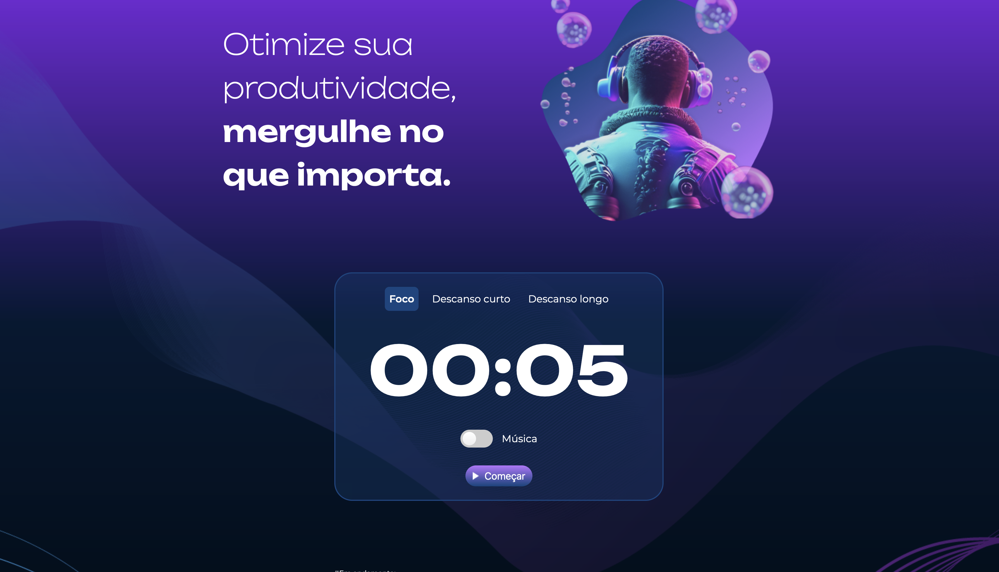

# Resumo do Projeto
Projeto foi realizado durante o curso de Front-End da Alura, visando as práticas de linguagens como JavaScript, HTML e CSS. O objetivo do projeto é otmizar da melhor maneira possível o tempo de suas atividades.

##  Funcionalidades do Projeto
-  Funcionalidade `1` - Adicionar Tarefa:` Existe o botão para a adicionar a tarefa e selecionar ao momento que for realiza-la.Além disso, existem botões para editar a atividade e remove-la.
- Funcionalidade `2` – Removendo Tarefas: No botão de opção, existem funcionalidades para remover todas as tarefas que já foram finalizadas ou remover todas as tarefas adicionadas.
- Funcionalidade `3` - Foco: Depois de selecionada a tarefa e escolhendo contexto Foco, ele tem o tempo de 25 minutos e tocará um alarme.
- Funcionalidade `4` - Descanso Curto: O contexto de Descanso Curto tem um tempo de 5 minutos para você descansar.
- Funcionalidade `5` - Descanso Longo:O contexto de Descanso Longo tem um tempo de 15 minutos para você descansar.

##  Técnicas e tecnologias utilizadas

- ``JavaScript``
- ``HTML``
- ``CSS``

